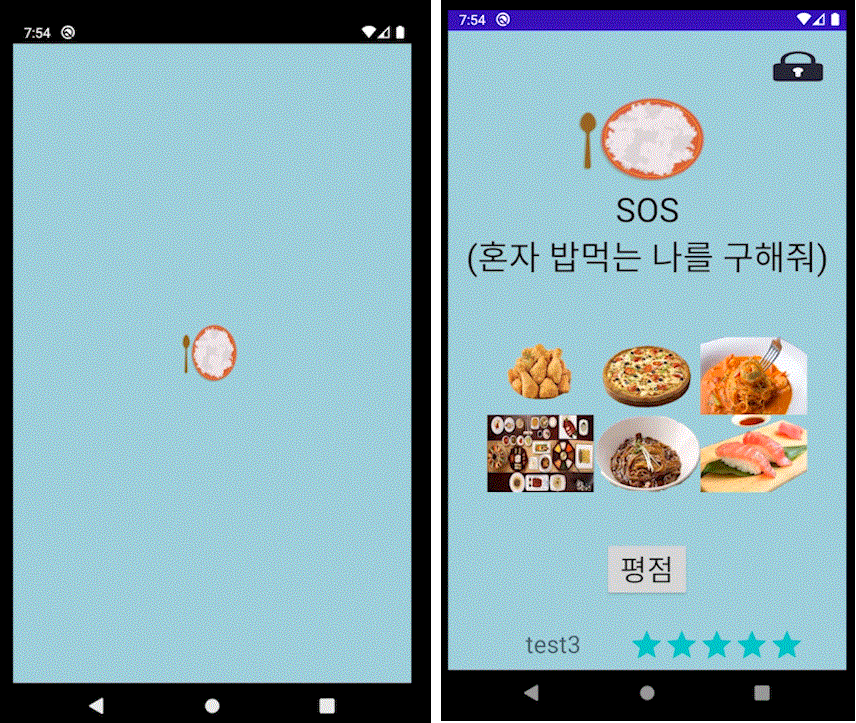
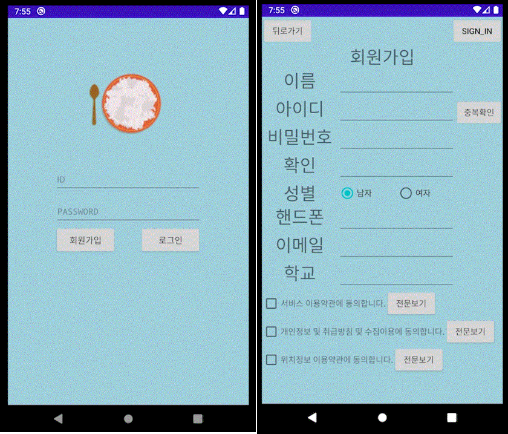
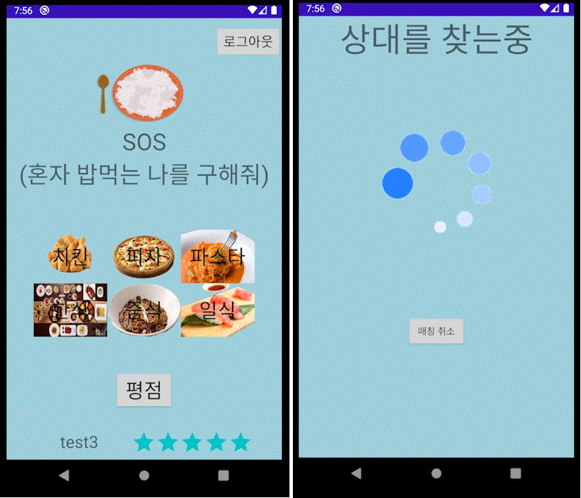
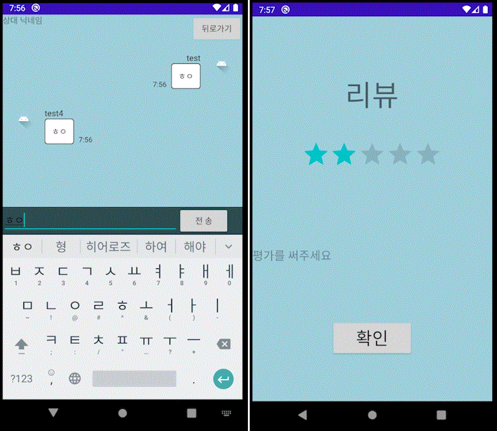

# Graduated_Work_User_Android (대학 졸업작품 (Android))
## 사용 언어
java(JDK v11.0.8)
## 사용 프로그램(OS)
Linux(Db Server, Web Server(API Parsing)), Window10(Develope), git, Android Studio(3.6.3), JDK(v11.0.8),AVD(Android Virtual Device)
## 개발자(이메일)
박치원(iptablecommandcode@gmail.com) 
이종운(dlwhddns5614@gmail.com) 
조상윤(chsyoon411@gmail.com) 
김용진(sangsoos9085@gmail.com)

# 안드로이드 채팅어플 (관리자 페이지와 같은 DB를 사용)

### 실행시 로딩, 메인

### 로그인, 계정 생성

### 로그인 화면, 채팅 매칭

### 채팅 창, 리뷰

